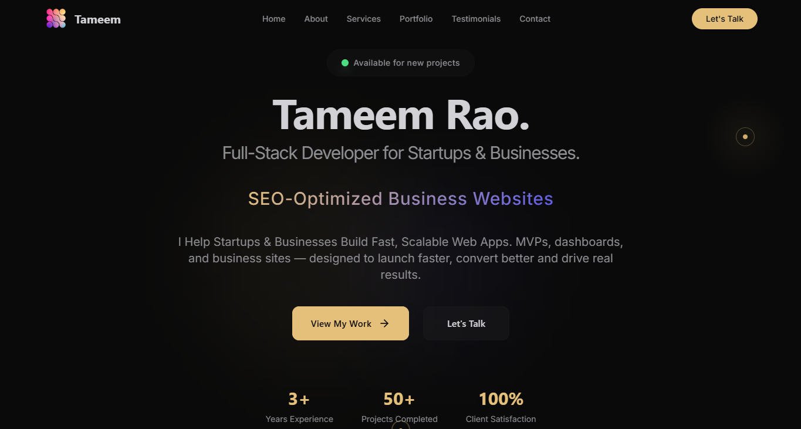

# 💻 Interactive Developer Portfolio – Built to Impress

## 🧩 The Problem
I needed a portfolio that not only showcased my skills but also delivered an engaging experience that leaves a lasting impression on visitors.

## 🚀 The Solution
I created a **visually striking portfolio** using **React** and **Three.js**, featuring smooth animations, interactive elements, and a clean layout that highlights my projects and skills effectively.

### ✅ Features Include:
- Scroll-based animations  
- Interactive project previews  
- Custom spotlight cursor  
- Responsive layout  
- 3D elements with Three.js  

Built with **React**, **Tailwind CSS**, and **Three.js**, the goal was to blend creativity, performance, and clarity in one seamless experience.

## 📚 What I Learned
This project taught me how to **balance aesthetics with performance**, ensuring smooth interactions and fast load times — even with advanced visuals.

## 🔗 https://tameemdev.vercel.app/

---

## 🏷 Tags:
#PortfolioWebsite  
#WebDesign  
#ReactJS  
#ThreeJS  
#FrontendDeveloper  
#JavaScript  
#TailwindCSS  
#DeveloperPortfolio  
#CreativeCoding  
#BuildInPublic
